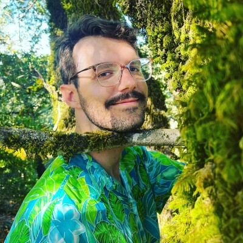
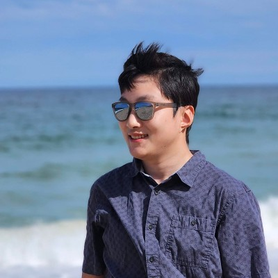
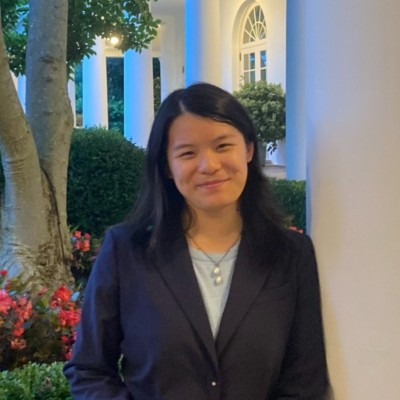
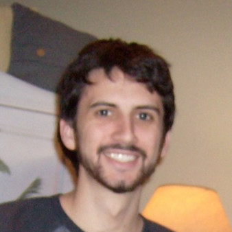

## About

Founded in 2012, Civic Tech DC is a non-partisan, non-political group of
volunteer civic hackers working together to solve local issues in the
Washington, DC area and helping people engage with the city. We host
twice-monthly project nights and other events to gather, discuss, and get stuff
done.

We're looking to bring people with all different skill sets together to
maximize our potential. Civic hackers aren't just developers — they're
journalists, lawyers, designers, and interested citizens in general. The
more community participation, the better.

To contact us, please email <team@civictechdc.org>.

<h2 style="text-align: center; font-size: 1.8rem; margin-bottom: 1rem; margin-top: 2rem;">Directors</h2>

    <!-- Alma Trotter -->
    

        
        
<a href="https://www.linkedin.com/in/almatrotter/" target="_blank" style="text-decoration: none; color: #0073b1;">Alma Trotter</a>

    

    <!-- Andrew Shao -->
    

        
        
<a href="https://www.linkedin.com/in/andrew-shao-55507497/" target="_blank" style="text-decoration: none; color: #0073b1;">Andrew Shao</a>

    

    <!-- Mike Deeb -->
    

        
        
<a href="https://www.linkedin.com/in/michael-deeb/" target="_blank" style="text-decoration: none; color: #0073b1;">Mike Deeb</a>

    

    <!-- Shelly Bachstein -->
    

        
        
<a href="https://www.linkedin.com/in/sbachstein/" target="_blank" style="text-decoration: none; color: #0073b1;">Shelly Bachstein</a>

    

 
<h2 style="text-align: center; font-size: 1.8rem; margin-bottom: 1rem; margin-top: 2rem;">Organizers</h2>

    <!-- Evan Tung -->
    

        
        
<a href="https://www.linkedin.com/in/ejtung/" target="_blank" style="text-decoration: none; color: #0073b1;">Evan Tung</a>

    

    

        
        
<a href="https://www.linkedin.com/in/helen-glover/" target="_blank" style="text-decoration: none; color: #0073b1;">Helen Glover</a>

    

    <!-- Justin Mezetin -->
    

        
        
<a href="https://www.linkedin.com/in/justin-mezetin-3649b866/" target="_blank" style="text-decoration: none; color: #0073b1;">Justin Mezetin</a>

    

    <!-- Yuliya Tkach -->
    

        
        
<a href="https://www.linkedin.com/in/yutk93/" target="_blank" style="text-decoration: none; color: #0073b1;">Yuliya Tkach</a>

    

<!-- Nick-->

    

        
        
<a href="https://www.linkedin.com/in/nick-stoler-0032b5168/" target="_blank" style="text-decoration: none; color: #0073b1;">Nick Stoler</a>

    

