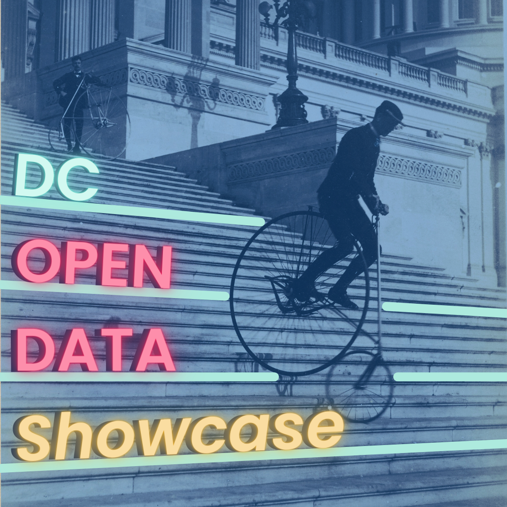

    
    

        <h1 style="margin-bottom: 10px; color: #f8c45c; font-size: 3.5rem; text-align: center; font-weight: bold; text-shadow: 2px 2px 4px rgba(0, 0, 0, 0.3);">
            Open Data DC Showcase 2025
        </h1>
        

            In Celebration with the annual Open Data Week, Civic Tech DC is partnering with the Office of the Chief Technology Officer (OCTO) to host the Open Data DC Showcase 2025, a celebration of Open Data DC and other public datasets about the District.    
            On Wednesday, March 26th, we're inviting local data practitioners, data journalists, and university students to give 10-minute lightning talks on how they've used Open Data DC or other publicly available datasets to solve city problems, tell compelling stories, or build helpful tools.
        

    

    <a href="https://lu.ma/53d1fuu9" target="_blank" style="text-decoration: none;">
        <button style="background-color: #f8c45c !important; color: white !important; min-width: 180px; max-width: 250px; padding: 1rem 2rem; font-size: 1.5rem; font-weight: bold; border-radius: 10px; box-shadow: 0 4px 6px rgba(0, 0, 0, 0.2); text-align: center; border: none; cursor: pointer;">
            Register
        </button>
    </a>
    <a href="https://forms.office.com/Pages/ResponsePage.aspx?id=8Unkj5SLt0-ZBm-Tnagtc7pJogXkrhtAl6gXRaUsRclUNUlDM0ZSVFpLRFFXTjhNNUZIMVRIUzdNUS4u" target="_blank" style="text-decoration: none;">
        <button style="background-color: #f8c45c !important; color: white !important; min-width: 180px; max-width: 250px; padding: 1rem 2rem; font-size: 1.5rem; font-weight: bold; border-radius: 10px; box-shadow: 0 4px 6px rgba(0, 0, 0, 0.2); text-align: center; border: none; cursor: pointer;">
            Talk Sign Up
        </button>
    </a>

    <h1 style="font-size: 2rem; font-weight: bold; color: #f8c45c; text-shadow: 2px rgba(0, 0, 0, 0.2);">
        Schedule
    </h1>
    <ul style="margin-top: 1rem; padding-left: 1rem; line-height: 1.8; font-size: 1.2rem">
        <li>6:30–7pm — Check in, hang out and network, grab a bite</li>
        <li>7–7:15pm — Introduction</li>
        <li>7:15–8:45pm — Lightning Talks</li>
        <li>8:45–9pm — Closing remarks</li>
        <li>9–9:30pm — Optional happy hour at a nearby bar</li>
    </ul>

    <h1 style="font-size: 2rem; font-weight: bold; color: #f8c45c; text-shadow: 2px rgba(0, 0, 0, 0.2);">
        Our Partners
    </h1>

    

        

            
        

        

            
Founded in 2012, Civic Tech DC is a non-partisan, non-political group of volunteer civic hackers working together to solve local issues and help people engage with the city.

        

    

    

        

            
        

        

            
OCTO is the central technology organization of the District of Columbia Government. OCTO develops, implements, and maintains the District’s technology infrastructure; develops and implements major enterprise applications; establishes and oversees technology policies and standards for the District.

        

    

    

        

            
        

        

            
The Mayor’s Office of the District of Columbia is the executive branch of Washington, DC’s government, responsible for overseeing city operations, implementing policies, and managing public services.

        

    

    <h1 style="font-size: 2rem; font-weight: bold; color: #f8c45c; text-shadow: 2px rgba(0, 0, 0, 0.2);">
        Lightning Talks - Coming soon on March 20
    </h1>

